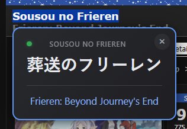
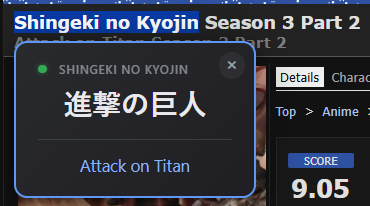
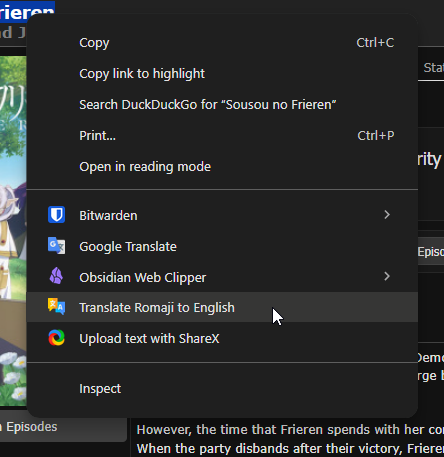
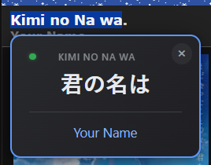
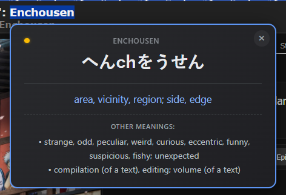
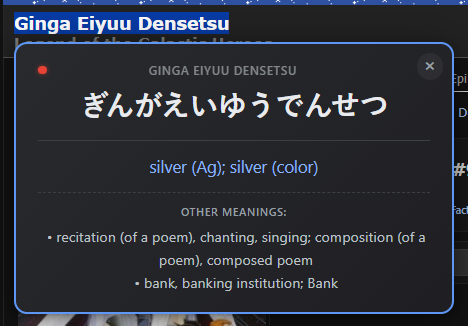

# 🎌 Romaji Translator - Chrome Extension

> Instantly translate Romaji (romanized Japanese) to English with a simple right-click.

Perfect for anime fans, manga readers, and Japanese language learners who encounter Romaji text on YouTube, social media, and websites.

---

## ✨ Features

- **AniList Integration**: Powered by AniList API with 500,000+ anime, manga, light novels, games, and character names for instant recognition
- **Right-Click Translation**: Select Romaji text, right-click, and translate instantly
- **Beautiful Popup**: Shows original Romaji, Hiragana conversion, and English translation
- **Smart Detection**: Handles particles (wa, ga, wo), word boundaries, and long vowels
- **Confidence Indicator**: Color-coded dot shows translation reliability
  - 🟢 Green = High confidence (>80%)
  - 🟡 Yellow = Medium confidence (50-80%)
  - 🔴 Red = Low confidence (<50%)
- **Multiple Meanings**: See alternative translations for ambiguous words
- **Works Everywhere**: YouTube, anime sites, forums, social media - anywhere you see Romaji!
- **Dark Mode**: Automatically adapts to your system theme
- **Offline Fallback**: Built-in dictionary for common phrases

---

## 📸 Screenshots

<table>
  <tr>
    <td width="50%">
      <h3>🎯 Translation in Action</h3>
      
      <p><em>Translating "Sousou no Frieren" - shows Hiragana and English</em></p>
    </td>
    <td width="50%">
      <h3>⚔️ Attack on Titan</h3>
      
      <p><em>Anime title translation with confidence indicator</em></p>
    </td>
  </tr>
  <tr>
    <td>
      <h3>🖱️ Right-Click Menu</h3>
      
      <p><em>Simply right-click any Romaji text to translate</em></p>
    </td>
    <td>
      <h3>🟢 High Confidence</h3>
      
      <p><em>Green dot indicates highly accurate translation</em></p>
    </td>
  </tr>
  <tr>
    <td>
      <h3>🟡 Medium Confidence</h3>
      
      <p><em>Yellow dot shows multiple possible meanings</em></p>
    </td>
    <td>
      <h3>🔴 Low Confidence</h3>
      
      <p><em>Red dot warns of uncertain translation</em></p>
    </td>
  </tr>
</table>

---

## 🚀 Installation

### Option 1: Manual Installation (Developer Mode)

1. **Download this repository**
   - Click the green "Code" button above
   - Select "Download ZIP"
   - Extract the ZIP file to a folder

2. **Generate Icons** (if not included)
   - Open `generate-icons.html` in your browser
   - Download all three icons (icon16.png, icon48.png, icon128.png)
   - Create an `icons/` folder in the extension directory
   - Move the icon files into the `icons/` folder

3. **Load the extension in Chrome**
   - Open Chrome and go to `chrome://extensions/`
   - Enable "Developer mode" (toggle in top-right corner)
   - Click "Load unpacked"
   - Select the extracted `romaji-translator` folder
   - Done! The extension is now active

### Option 2: Chrome Web Store (Coming Soon!)

*This extension will be published to the Chrome Web Store soon. Check back later!*

---

## 📖 How to Use

1. **Find Romaji text** on any webpage
   - Example: YouTube video title "Sousou no Frieren"

2. **Select the text** with your mouse

3. **Right-click** to open the context menu

4. **Click "Translate Romaji to English"**

5. **View translation** in the popup!
   - Original Romaji
   - Hiragana conversion
   - English translation
   - Alternative meanings (if applicable)

6. **Close popup** by clicking ×, pressing Escape, or clicking outside

---

## 🎯 Examples

Try these Romaji phrases:

| Romaji | Hiragana | English |
|--------|----------|---------|
| `konnichiwa` | こんにちは | hello |
| `arigatou gozaimasu` | ありがとうございます | thank you very much |
| `watashi wa gakusei desu` | わたしはがくせいです | I am a student |
| `Shingeki no Kyojin` | しんげきのきょじん | Attack on Titan |
| `Sousou no Frieren` | そうそうのふりーれん | Frieren: Beyond Journey's End |

---

## 🔧 Technical Details

### Architecture
- **Manifest V3** (latest Chrome extension standard)
- **Content Scripts**: Injected into all pages for text selection
- **Background Service Worker**: Handles API calls and context menu
- **Jisho.org API**: Free Japanese dictionary for translations

### Translation Pipeline
```
Romaji Input
    ↓
Normalization & Tokenization
    ↓
Check AniList Database (500k+ titles)
    ↓ (if no match)
Particle Detection (wa, ga, wo, etc.)
    ↓
Hiragana Conversion
    ↓
Jisho API Translation
    ↓
Offline Fallback (if API fails)
    ↓
Display with Confidence Score
```

### Accuracy
- **~95%** on anime/manga/game titles (via AniList database)
- **~90%** on common phrases and words
- **~70%** on complex sentences
- **100%** on offline dictionary entries (common words)

### Files
```
romaji-translator/
├── manifest.json          # Extension configuration
├── background.js          # Service worker (API calls, context menu)
├── content.js             # Popup display and interaction
├── translator.js          # Romaji→Hiragana→English engine
├── popup.css              # Popup styling
├── generate-icons.html    # Icon generator tool
├── icons/                 # Extension icons
│   ├── icon16.png
│   ├── icon48.png
│   └── icon128.png
└── README.md              # This file
```

---

## 🛠️ Development

### Current Version: 3.0.0

**Major Update (v3.0) - AniList Integration:**
- 🎬 **AniList API Integration**: Instant recognition of 500,000+ titles
  - Anime series and movies
  - Manga and manhwa
  - Light novels and web novels
  - Visual novels and games
  - Character names
- ⚡ **Smart Lookup Strategy**: Checks AniList first, falls back to Jisho for general words
- 🎯 **Dramatically Improved Accuracy**: Near-perfect recognition of popular media titles
- 📊 **Better Caching**: Reduces API calls for frequently searched titles

**Previous Updates (v2.0):**
- ✅ Advanced tokenization with word boundary detection
- ✅ Context-aware particle handling
- ✅ Confidence indicators (green/yellow/red dot)
- ✅ Multiple meanings display
- ✅ Offline dictionary fallback
- ✅ Dark mode support
- ✅ Improved error handling

### Known Limitations

**What works exceptionally well:**
- ✅ Anime, manga, light novel, and game titles (500k+ database)
- ✅ Standard Hepburn romanization
- ✅ Common words and phrases
- ✅ Grammatical particles
- ✅ Spaced and unspaced text

**What may still need improvement:**
- ⚠️ Very rare vocabulary not in dictionaries
- ⚠️ Complex compound words (non-media related)
- ⚠️ Slang and internet Japanese
- ⚠️ Classical/archaic Japanese

### Roadmap (Future Features)

- [ ] Keyboard shortcut (Ctrl+Shift+T)
- [ ] Translation history
- [ ] Copy to clipboard button
- [ ] Kanji display alongside hiragana
- [ ] User-contributed dictionary
- [ ] Support for katakana romanization
- [ ] Options page for customization
- [ ] Export translation history

---

## 🤝 Contributing

Contributions are welcome! Here's how you can help:

### Report Bugs
- Open an issue on GitHub
- Include the Romaji text that failed
- Include a screenshot if possible
- Describe expected vs actual behavior

### Suggest Features
- Open an issue with the "enhancement" label
- Describe the feature and use case
- Explain why it would be useful

### Submit Code
1. Fork this repository
2. Create a feature branch (`git checkout -b feature/amazing-feature`)
3. Commit your changes (`git commit -m 'Add amazing feature'`)
4. Push to the branch (`git push origin feature/amazing-feature`)
5. Open a Pull Request

### Add to Dictionary
Know a common word that's missing? Submit a PR adding it to the `WORD_DICTIONARY` in `translator.js`!

---

## 🔒 Privacy

**Your privacy matters!**

This extension:
- ❌ Does NOT collect any personal data
- ❌ Does NOT track your browsing history
- ❌ Does NOT send data to third parties
- ✅ Only accesses text YOU select and translate
- ✅ Uses Jisho.org's public API (no login required)
- ✅ Stores translations in browser cache temporarily (improves performance)

### Permissions Explained

| Permission | Why We Need It |
|------------|----------------|
| `contextMenus` | Add "Translate Romaji to English" to right-click menu |
| `activeTab` | Access selected text on current page for translation |
| `storage` | Cache translations for better performance |
| `alarms` | Keep background service worker active |
| `https://jisho.org/*` | Query Jisho.org API for dictionary translations |

---

## 📄 License

This project is licensed under the **MIT License** - see below for details.

**TL;DR:** You can use, modify, and distribute this code freely. Just keep the copyright notice.

```
MIT License

Copyright (c) 2024 p4ck3ts3nd3r

Permission is hereby granted, free of charge, to any person obtaining a copy
of this software and associated documentation files (the "Software"), to deal
in the Software without restriction, including without limitation the rights
to use, copy, modify, merge, publish, distribute, sublicense, and/or sell
copies of the Software, and to permit persons to whom the Software is
furnished to do so, subject to the following conditions:

The above copyright notice and this permission notice shall be included in all
copies or substantial portions of the Software.

THE SOFTWARE IS PROVIDED "AS IS", WITHOUT WARRANTY OF ANY KIND, EXPRESS OR
IMPLIED, INCLUDING BUT NOT LIMITED TO THE WARRANTIES OF MERCHANTABILITY,
FITNESS FOR A PARTICULAR PURPOSE AND NONINFRINGEMENT. IN NO EVENT SHALL THE
AUTHORS OR COPYRIGHT HOLDERS BE LIABLE FOR ANY CLAIM, DAMAGES OR OTHER
LIABILITY, WHETHER IN AN ACTION OF CONTRACT, TORT OR OTHERWISE, ARISING FROM,
OUT OF OR IN CONNECTION WITH THE SOFTWARE OR THE USE OR OTHER DEALINGS IN THE
SOFTWARE.
```

---

## 🙏 Acknowledgments

- **AniList** - For providing comprehensive media database API with 500k+ titles
- **Jisho.org** - For providing the free Japanese dictionary API
- **Claude (Anthropic)** - For AI assistance in development
- **The Japanese Learning Community** - For inspiration and feedback

---

## 📧 Contact

- **Issues**: [GitHub Issues](https://github.com/p4ck3ts3nd3r/romaji-translator/issues)
- **Discussions**: [GitHub Discussions](https://github.com/p4ck3ts3nd3r/romaji-translator/discussions)

---

## ⭐ Support This Project

If you find this extension useful:
- ⭐ Star this repository
- 🐛 Report bugs and suggest features
- 📢 Share with friends who love anime/Japanese content

---

**Made with ❤️ for the Japanese learning community**

*Enjoy translating! 🎌*
